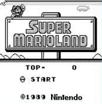

# GoGB [](https://github.com/guigzzz/GoGB/actions/workflows/go.yml)



GoGB is a work-in-progress of a Gameboy emulator written in Go. The main objectives for this project are:

- build a medium-large sized project in Go to become familiar with the language and the design patterns associated with it.
- write an emulator that is performant enough to run [Super Mario Land](https://en.wikipedia.org/wiki/Super_Mario_Land) at a playable frame-rate.
- I am not planning on implementing sound for now.

## Build Instructions

```
sudo apt install xorg-dev libgl1-mesa-dev
git clone https://github.com/guigzzz/GoGB
cd GoGB && go build
./GoGB <path to rom>
```

## Controls

- `up, left, down, right = w, a, s, d`
- `A, B = j, k`
- `start, select = u, i`

# Todo

- [x] create unit test suite for backend
  - [x] instructions: arithmetic
  - [x] instructions: memory
  - [x] instructions: rotates
  - [x] instructions: shifts
  - [x] instructions: miscellaneous
  - [x] CPU base
- [x] implement basic graphics to be able to run test suite
  - [x] learn how to draw graphics in Go + basic implementation
  - [x] implement draw background
  - [x] implement draw sprites
  - [x] implement draw Window
- [x] Advanced tests: get the backend to pass correctness and timing tests
  - [x] Run blargg tests as a standard go test
  - [x] Automatically run blargg tests on commit
- [x] Robust graphics implementation
  - [x] Tetris playable
  - [x] Super Mario Land playable
